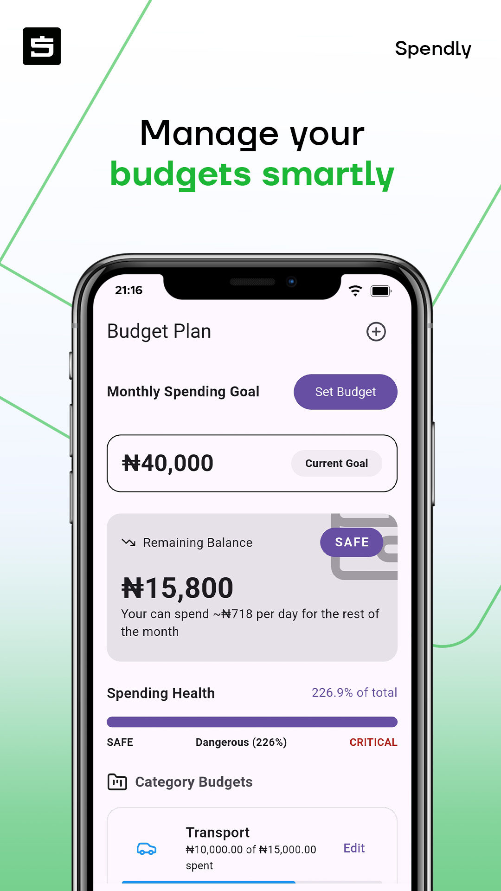
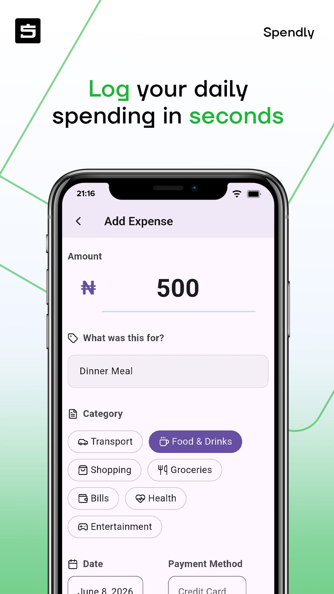

# Spendly — Smart Expense Tracker 💰

Spendly is a modern personal finance and expense tracking mobile application built with Flutter.

Designed to help users track expenses, manage budgets, and build healthier spending habits through a clean and intuitive experience.

## Features

### Authentication

* Google Sign-In
* Secure Firebase Authentication

### Expense Management

* Add income and expenses
* Categorize spending
* Payment method tracking
* Expense details view

### Budgeting

* Monthly budgeting
* Category-based budgets
* Spending insights

### Analytics

* Expense visualization
* Spending trends
* Financial overview

### Personalization

* Currency selection
* Region support
* Dark mode
* Theme customization

## Screenshots






## Tech Stack

* Flutter
* Dart
* Firebase Authentication
* Cloud Firestore
* Hive Local Database
* Provider State Management
* GoRouter Navigation

## Architecture

Spendly follows a scalable Flutter architecture using:

* Provider for state management
* Feature-based structure
* Firebase backend integration
* Local persistence with Hive

## Installation

Clone repository:

```bash
git clone https://github.com/demystik/spendly.git
```

Install dependencies:

```bash
flutter pub get
```

Run app:

```bash
flutter run
```

## Download

Google Play Store (Testing Version)
Link:

## Roadmap

* Savings goals
* Smarter analytics
* Cloud sync improvements
* Notifications
* Financial insights

## Author

Thaoban, Abu Ayo, Yinka, — Flutter Mobile Developer

Building modern mobile applications with Flutter.
